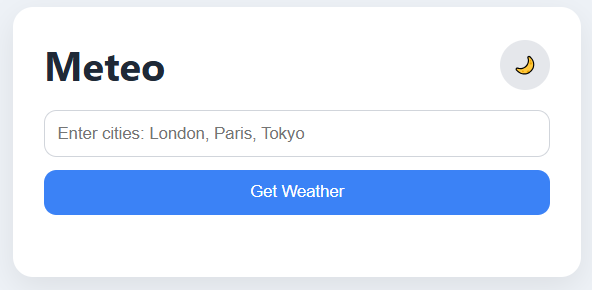
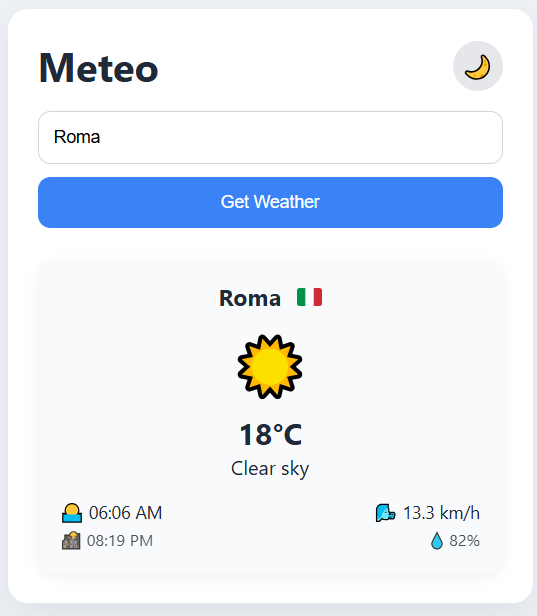
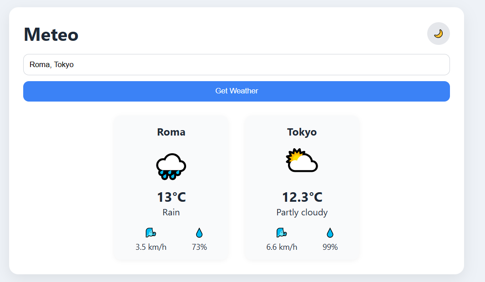
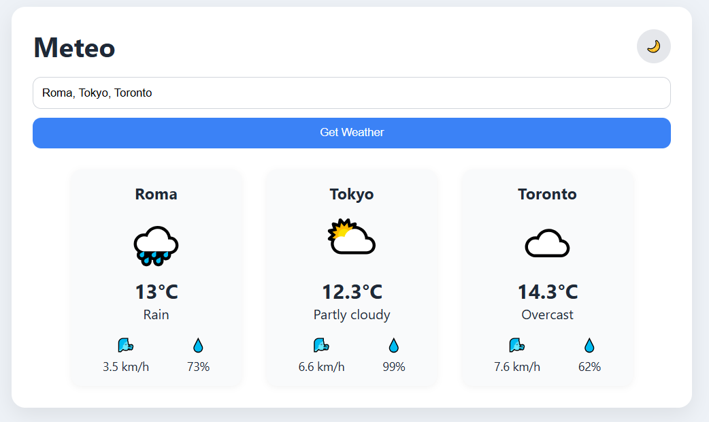
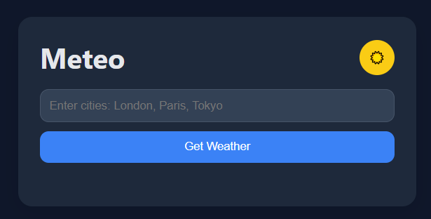
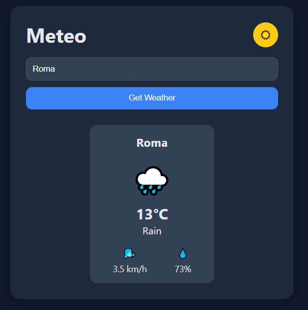
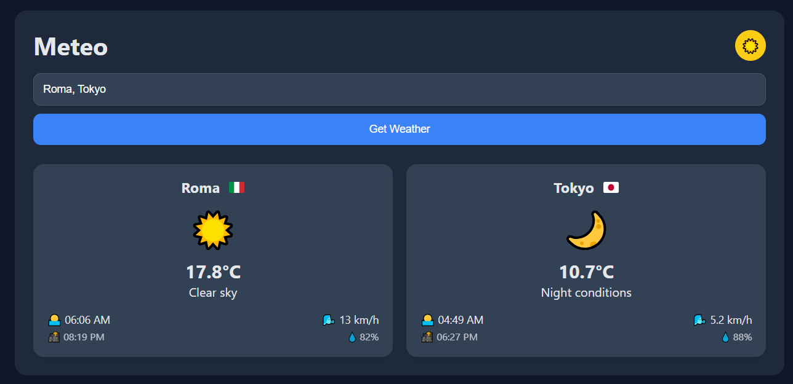
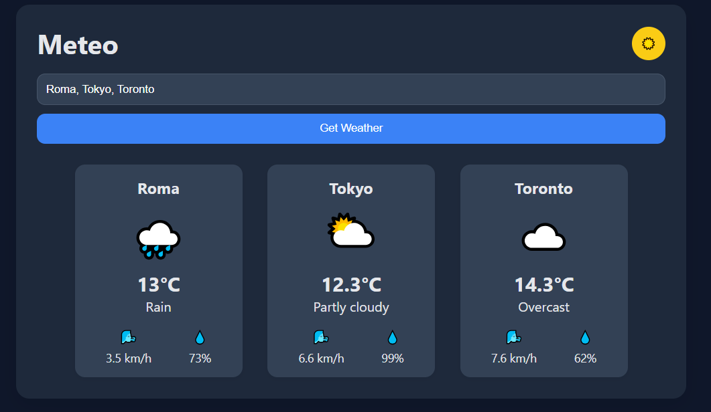

# 🌤️ Meteo App ✅ https://velvetred2020.github.io/meteo-app/

## 📌 Project Overview

This is a simple and responsive **Weather App** that allows users to search for one or multiple cities and retrieve real-time weather data. The application uses the **Open-Meteo API** to display key weather information such as temperature, weather conditions, wind speed, and humidity.

It includes a **dark/light mode toggle** and a **dynamic multi-city layout** that adjusts based on how many cities are searched.

---

## ⚙️ Installation Instructions

Follow these steps to run the project locally:

1. **Clone or download the repository**

   ```bash
   git clone <your-repo-url>
   cd weather-app
   ```

2. **Ensure file structure**

   ```
   meteo-app/
   ├── img/
   │   ├── light_initial.png
   │   ├── light_one_city.png
   │   ├── light_two_cities.png
   │   ├── light_three_cities.png
   │   ├── dark_initial.png
   │   ├── dark_one_city.png
   │   ├── dark_two_cities.png
   │   ├── dark_three_cities.png
   ├── app.js
   ├── index.html
   ├── style.css
   └── README.md
   ```

3. **Run the app**
   - Simply open `index.html` in your browser
   - No build tools or dependencies required

---

## 🚀 Usage Guide

1. Open the app in your browser
2. Enter one or more city names separated by commas:

London, Paris, Tokyo

3. Click **"Get Weather"**
4. View results displayed as responsive weather cards

### 🌙 Dark Mode

Click the moon/sun icon in the top-right corner to toggle between light and dark mode.

---

## 🧭 Multi-City Feature

The app now supports **multiple city searches at once**.

### Example input:

London, Paris, Tokyo

### Behavior:

- 1 city → focused layout (compact view)
- 2+ cities → expanded dashboard layout
- Each city is displayed as an independent weather card

The layout automatically adjusts based on how many cities are entered, improving usability and visual balance.

---

## 📸 Screenshots

### 🌤️ Light Mode

Initial State  


One City  


Two Cities  


Three Cities  


---

### 🌙 Dark Mode

Initial State  


One City  


Two Cities  


Three Cities  


---

## ✨ Features

- 🔍 Search one or multiple cities
- 🌡️ Temperature in Celsius
- 🌬️ Wind speed display
- 💧 Humidity levels
- 🌤️ Weather condition icons
- 🌙 Dark / Light mode toggle
- 📊 Side-by-side responsive layout
- ⚡ Fast API integration (Open-Meteo)
- 🧠 Weather code interpretation system

---

## ⚠️ Error Handling

The app handles common issues gracefully:

- ❌ Invalid city → "City not found"
- ⚠️ API failure → "API error"
- 🌐 Network issue → "Network error"
- 🚫 Empty input is ignored safely

---

## 🌐 API Information

This app uses the free **Open-Meteo API**.

### Geocoding API

https://geocoding-api.open-meteo.com/v1/search?name={city}

### Weather Forecast API

https://api.open-meteo.com/v1/forecast

### Data provided:

- Temperature
- Weather codes
- Wind speed
- Humidity (hourly data)

---

## 🔮 Future Enhancements

- 📍 Geolocation auto-detect
- 📅 5-day forecast
- 🌡️ Celsius/Fahrenheit toggle
- 🔎 City autocomplete search
- 💾 Save favorite cities (localStorage)
- 📊 Weather charts (temperature trends)
- 🌍 Multi-language support
- 🔄 Auto-refresh weather data
- 🎨 Improved UI animations
- 📱 Mobile-first redesign

---

## 🧑‍💻 Notes

- Built using vanilla HTML, CSS, and JavaScript
- Uses Open-Meteo API (no API key required)
- Fully responsive and lightweight
- Designed as a beginner-friendly weather dashboard project

---

## 🎯 Project Goal

This project is designed to demonstrate:

- API integration skills
- DOM manipulation
- Responsive layout design
- Clean modular JavaScript
- UI/UX improvement through iteration
